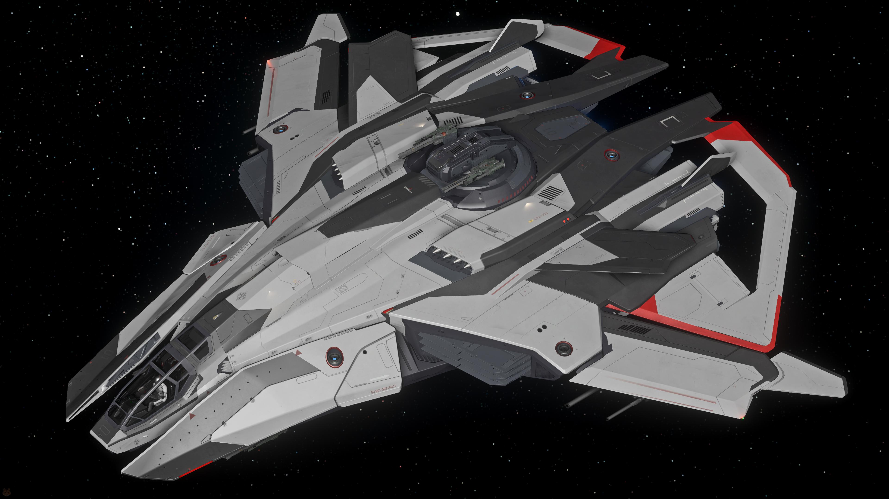

# Asteroid-Belt Runner (F8C)

A playful side project inspired by NYU ROB-GY 7863 (Special Topics). Not a formal submission—just for fun. It intend to control the **[F8C](https://robertsspaceindustries.com/en/pledge/ships/lightning/f8c-lightning)** from **[Star Citizen](https://robertsspaceindustries.com/en/)** to dash through an **asteroid** belt that has “killed” me **hundreds** of times 🙃



## Getting Started

### 1) Create & activate Conda env

```bash
conda create -n asteroid-belt-runner python=3.11 -y
conda activate asteroid-belt-runner
```

### 2) Install dependencies

```bash
pip install -r requirements.txt
```

## Roadmap / TODO

1. Add an asteroid belt to the MuJoCo environment.
2. Build a learning-based controller with simplified dynamics to traverse the belt.
3. Add more realistic dynamics: 12 posture thrusters, 2 main thrusters, 3 reverse thrusters.
4. Implement keyboard flight control for both simplified and realistic dynamics.
5. Train a learning-based controller on the realistic dynamics.
