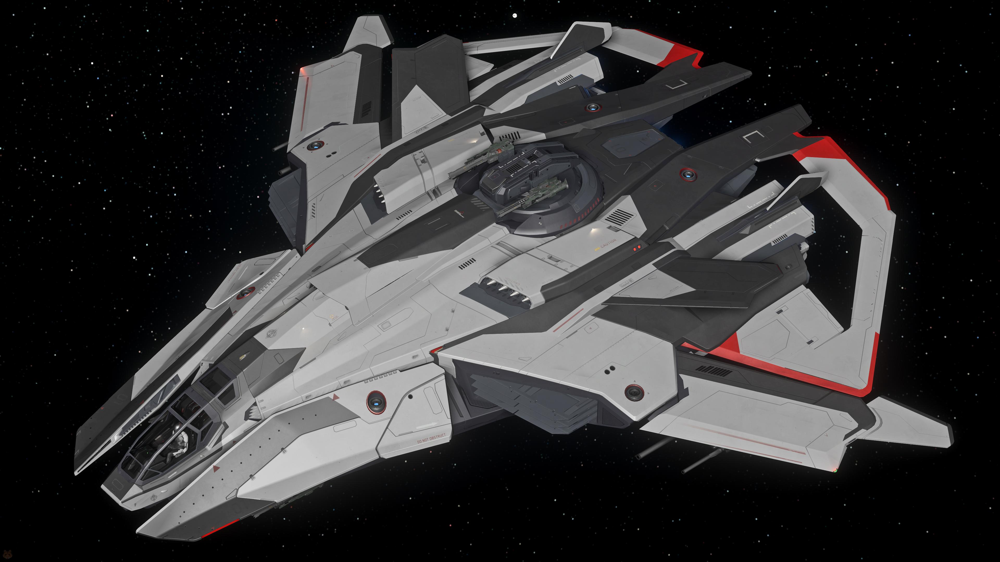
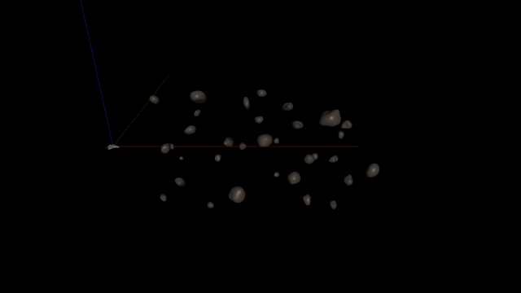
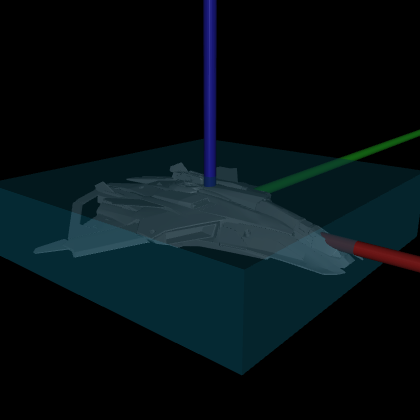

<h1 align="center">🛰️ Asteroid-Belt Runner</h1>

<p align="center">
  <em>Teaching the <a href="https://robertsspaceindustries.com/en/pledge/ships/lightning/f8c-lightning">F8C Lightning</a> from
  <a href="https://robertsspaceindustries.com/en/">Star Citizen</a> to thread an asteroid belt that has killed me
  <strong>hundreds</strong> of times — with reinforcement learning, in MuJoCo. 🙃</em>
</p>

<p align="center">
  
  
  
  
  
</p>

<p align="center"></p>

> A playful side project inspired by NYU ROB-GY 7863 (Special Topics). Not a formal submission — just for fun.

---

## ✨ What it does

A PPO agent flies the F8C — modeled with **real F8C thrust & rotation specs** — from a start point, **through** a
procedurally-generated asteroid belt, to a goal on the far side. The belt is built so the ship **can't cheat by going
around it**: it has to weave through the rocks.

<p align="center">
  
  &nbsp;
  
</p>
<p align="center"><sub>left: the belt the ship must thread (ship at the left, red = +X travel axis) &nbsp;·&nbsp; right: the F8C with its oriented collision box (wings count)</sub></p>

## 🚀 Highlights

- **🛰️ Full-sphere radar observation** — a body-frame 12×6 azimuth/elevation grid (proximity + closing velocity per bin).
  Fixed-size no matter how many rocks, so the policy scales to any belt density.
- **🔥 F8C-calibrated flight model** — asymmetric main/retro thrust (10.55 G / 3.70 G) and RCS torques sized to the real
  roll/pitch/yaw rates. A **G-load reward** keeps the (virtual) pilot alive.
- **🪨 Procedural "potato" belt** — irregular bumpy meshes, power-law sizes, slow drift + spin, guaranteed-passable gaps,
  rebuilt cheaply every episode.
- **🎯 Random off-axis exits** — each run the goal pops up at a random spot on the far side, so the ship must *navigate*,
  not just punch straight through — and it's rewarded for doing it **fast**.
- **🎓 Curriculum learning** — density ramps from sparse to full as the policy improves.

## 📊 Result

The simplified-dynamics controller **learns to thread the belt**:

| metric | value |
|---|---|
| ✅ success (reaches the exit) | **41 %** |
| 🚧 out-of-bounds (skirting / bailing) | **0 %** |
| 💥 collision | 59 % |

0 % out-of-bounds is the headline: the policy genuinely flies *through* the gaps instead of sneaking around the belt.
Pre-trained weights: [`models/ppo_v15_best_41pct.zip`](models/).

```bash
Agent_tool/watch.sh models/ppo_v15_best_41pct.zip 30 40   # watch it fly (needs a display)
```

## 🧠 How the task is framed (RL)

| | |
|---|---|
| **Observation (160-d)** | ego vel / ang-vel / orientation / goal dir+dist (16) + full-sphere radar (2 × 12 × 6) |
| **Action (6-d)** | normalized force/torque → F8C-calibrated thrust + RCS (realistic 17-thruster mode also built) |
| **Reward** | goal-potential + speed-to-goal + heading − proximity − spin − G-load − time; **+200** exit, **−300** crash, **−100** out-of-bounds |
| **Episode ends** | reach the exit sphere ✅ · hit a rock 💥 · leave the corridor 🚧 · timeout ⏱️ |

## ⚡ Quickstart

```bash
# 1) Build the env (Python 3.11; the RL stack needs numpy < 2)
conda create -n asteroid-belt-runner python=3.11 -y
conda run -n asteroid-belt-runner pip install \
    "mujoco==3.3.7" "gymnasium==0.29.1" "stable-baselines3==2.3.0" \
    "numpy<2" "torch==2.2.1" pynput tensorboard "imageio[ffmpeg]"

# 2) Sanity-check the env
conda run -n asteroid-belt-runner python Agent_tool/check_env.py

# 3) Train (crash-resilient wrapper, ~3M steps)
Agent_tool/train_resilient.sh ppo_run 3000000 40 --curriculum --n-start 8 --max-steps 3000

# 4) Evaluate / watch
conda run -n asteroid-belt-runner python Agent_tool/eval_policy.py --model models/ppo_v15_best_41pct.zip --episodes 100 --n-asteroids 40
Agent_tool/watch.sh models/ppo_v15_best_41pct.zip 30 40
```

<details>
<summary><b>⚠️ Crash note (torch 2.2.1)</b></summary>

This stack's `torch._dynamo` intermittently **segfaults at import** (a C-level flake; harmless once past startup).
Handled in `train/train_ppo.py` via `SubprocVecEnv(start_method="forkserver")` + deferred torch imports + warm-import
retry, with `Agent_tool/train_resilient.sh` auto-resuming the rare startup flake. **Don't switch to `spawn`
(constant crashes) or `fork` (CUDA deadlock).**
</details>

## 🗂️ Repo layout

```
envs/            # MuJoCo scene builder, Gymnasium env, asteroid meshes, 17-thruster layout
train/           # PPO training (SB3) + curriculum
Agent_tool/      # check_env, eval_policy, viewers, watch.sh, train_resilient.sh
models/          # tracked best-model snapshots
main.py          # manual keyboard play (for fun)
```

## 🗺️ Roadmap

- [x] Asteroid belt in MuJoCo
- [x] Learning-based controller (simplified dynamics) that traverses the belt
- [x] Realistic 17-thruster dynamics model (2 main · 3 retro · 12 RCS) — built & 6-DOF verified
- [ ] Keyboard flight control for both dynamics modes
- [ ] Train the controller on the realistic 17-thruster dynamics
- [ ] Push success past 41 % (early-stopping + collision-aware reward)
</content>
